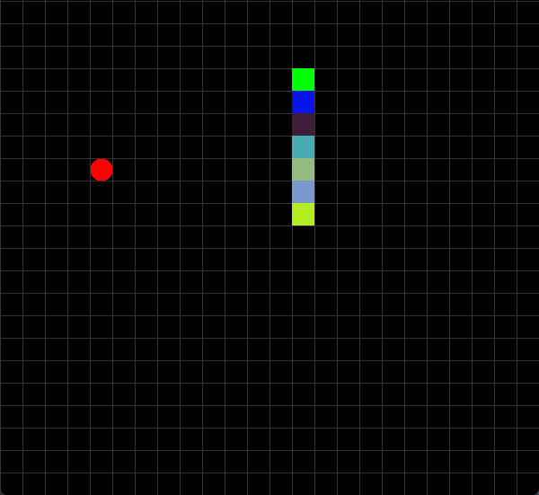

# Snakey
🐍 Fast-paced Snake Game written in Java with a scoring & progressive difficulty system & nice UI.

## What is it?
Snake is a video game genre where the player maneuvers a growing line that becomes a primary obstacle to itself. The concept originated in the 1976 two-player arcade game Blockade from Gremlin Industries, and the ease of implementation has led to hundreds of versions (some of which have the word snake or worm in the title) for many platforms. 1982's Tron arcade game, based on the film, includes snake gameplay for the single-player Light Cycles segment. After a variant was preloaded on Nokia mobile phones in 1998, there was a resurgence of interest in snake games as it found a larger audience.

<p></p>

## Changelogs
- Rainbow skin when ```Points >= 15;```